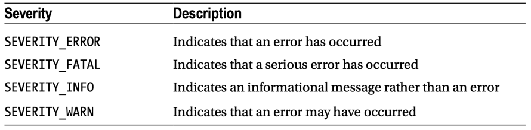

- `id`: Specifies a unique identifier for the component
- `rendered`: Specifies whether the message is rendered
- `errorStyle`: Specifies the CSS styles to be applied to error messages
- `errorClass`: Indicates the CSS class to apply to error messages
- `infoStyle`: Specifies the CSS styles to be applied to informational messages
- `infoClass`: Indicates the CSS class to apply to informational messages
- `for`: Specifies the component for which the message belongs

```java
new FacesMessage(FacesMessage.severity severity, String summary, String detail)
```


```java
FacesMessage javaTextMsg = new FacesMessage(FacesMessage.SEVERITY_ERROR, "invalid email", null);
            FacesContext.getCurrentInstance().addMessage("componentForm:email", javaTextMsg);
```
match voi cai id `componentForm:email`
```xhtml
<h:form id="componentForm">
    ...
    
    <h:messages for="email" errorStyle="color: brown" infoStyle="color: green" globalOnly="true"/>
    email: <h:inputText id="email" value="#{q04WebController.userEmail}"/>
    <br/><br/>

    <h:commandButton action="#{q04WebController.register()}" value="register"/>
</h:form>
```
va null la cho global khong co `for` va `id`
```java
FacesMessage facesMessage = new FacesMessage(FacesMessage.SEVERITY_INFO, "welcome", null);
            FacesContext.getCurrentInstance().addMessage(null, facesMessage);
```
```xhtml
<h:messages errorStyle="color: red" infoStyle="color: green" globalOnly="true"/>
```