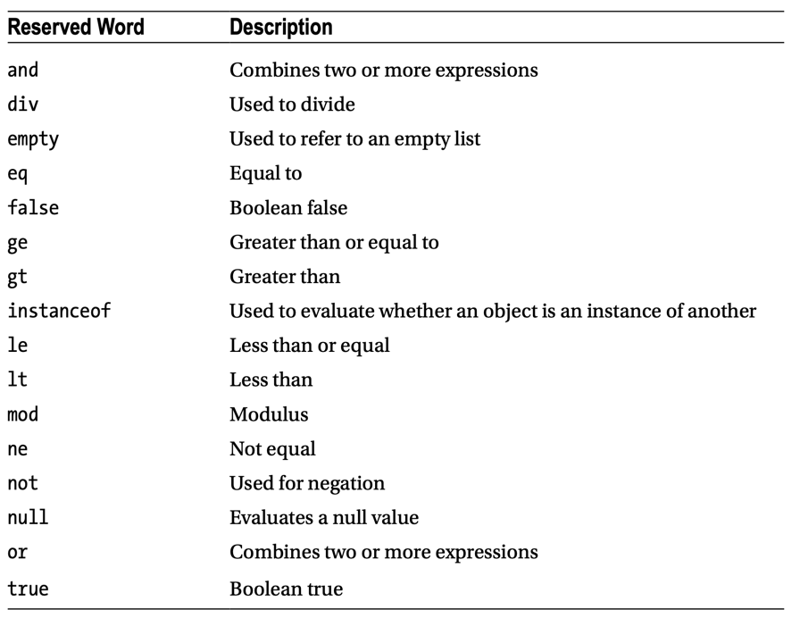
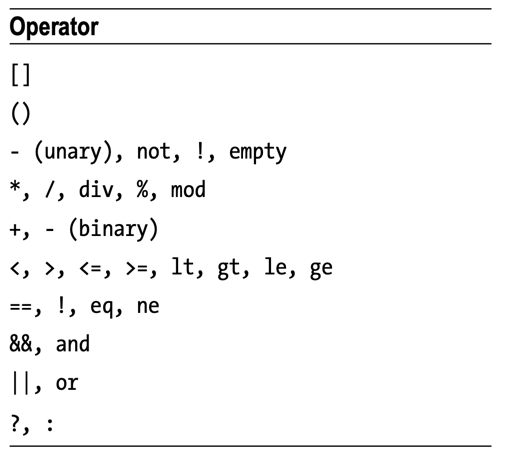

```html
<h:form rendered="#{some boolean condition}">
```
You usually tie it to the model rather than letting the model grab the component and manipulate it.

E.g.

```xhtml
<h:form rendered="#{bean.booleanValue}" />
<h:form rendered="#{bean.intValue gt 10}" />
<h:form rendered="#{bean.objectValue eq null}" />
<h:form rendered="#{bean.stringValue ne 'someValue'}" />
<h:form rendered="#{not empty bean.collectionValue}" />
<h:form rendered="#{not bean.booleanValue and bean.intValue ne 0}" />
<h:form rendered="#{bean.enumValue eq 'ONE' or bean.enumValue eq 'TWO'}" />
```
Note the importance of keyword based EL operators such as `gt`, `ge`, `le` and `lt` instead of `>`, `>=`, `<=` and `<` as angle brackets < and > are reserved characters in XML. See also this related Q&A: Error parsing XHTML: The content of elements must consist of well-formed character data or markup.

As to your specific use case, let's assume that the link is passing a parameter like below:

```xhtml
<a href="page.xhtml?form=1">link</a>
```
You can then show the form as below:

```xhtml
<h:form rendered="#{param.form eq '1'}">
```
(the #{param} is an implicit EL object referring to a Map representing the request parameters)

```xhtml

<h:body>
    <h:form id="componentForm">
        <h1>JSF Arithmetic and Reserved Words in EL</h1>
        <p>
            The following examples use JSF EL to perform some arithmetic.
        </p>
        1 + 1 = #{1 + 1}
        <br/>
        <h:outputText value="20 / 5 = #{20 / 5}"/>
        <br/>
        <h:outputText rendered="#{1 + 1 eq 2}" value="1 + 1 DOES equal 2"/>
        <br/>
        <h:outputText rendered="#{5 * 4 != 20}" value="Is 5 * 4 equal to 20?"/>
        <br/>
        <h:outputText rendered="#{5 * 5 eq 25 and 1 + 1 eq 2}" value="Combining some
expressions"/>
        <br/>
        <c:if test="#{evaluationController.expr1()}">
            This will be displayed if expr1() evaluates to true.
        </c:if>
        <br/>
        <c:if test="#{evaluationController.expr2() or evaluationController.field1}">
            This will be displayed if expr2() or field1 evaluates to true.
        </c:if>
    </h:form>
</h:body>
```


https://eclipse-ee4j.github.io/jakartaee-tutorial/#expression-language


